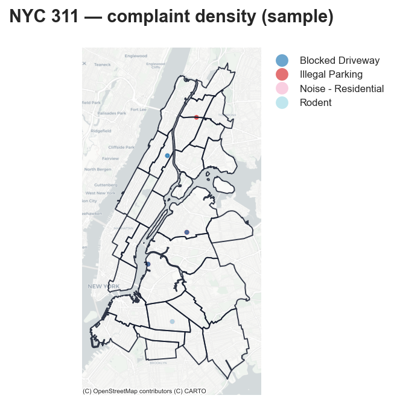

# nyc311



[![Actions Status][actions-badge]][actions-link]
[![Documentation Status][rtd-badge]][rtd-link]
[![PyPI version][pypi-version]][pypi-link]
[![PyPI platforms][pypi-platforms]][pypi-link]

Python toolkit for reproducible NYC 311 complaint analysis via a typed SDK and
CLI.

Authored by [Blaise Albis-Burdige](https://blaiseab.com/).

## What this package does

`nyc311` is the stable `0.2.x` toolkit for turning NYC 311 service-request data
into reproducible complaint-intelligence outputs.

It pairs a thin CLI with a typed SDK so the same workflow can run in batch jobs,
scripts, notebooks, and consumer packages.

The current release line provides:

- load filtered NYC 311-style records from local CSV extracts or the live
  Socrata API
- derive deterministic first-pass topic labels for supported complaint types
- aggregate complaint topics by borough or community district
- measure topic-rule coverage and summarize resolution gaps
- score anomalies over aggregated topic summaries
- export CSV tables, boundary-backed GeoJSON, and markdown report cards
- expose the workflow through both a thin CLI and a composable functional SDK

## Geography layer

`nyc311.geographies` is the 311-facing compatibility layer over
[`nyc-geo-toolkit`](https://github.com/random-walks/nyc-geo-toolkit).

Use `nyc311` when you want packaged NYC boundaries inside the 311 workflow. Use
`nyc-geo-toolkit` directly when you only need the generic geography assets,
normalization helpers, and boundary loaders.

## Install

Choose the dependency footprint that matches your workflow:

```bash
pip install nyc311
```

For the full turnkey experience:

```bash
pip install "nyc311[all]"
```

For pandas-backed conversion helpers:

```bash
pip install "nyc311[dataframes]"
```

For geopandas-backed geography and spatial helpers:

```bash
pip install "nyc311[spatial]"
```

For plotting helpers:

```bash
pip install "nyc311[plotting]"
```

For plotting and exploratory analysis without the geospatial stack:

```bash
pip install "nyc311[science]"
```

## Why this exists

NYC 311 data is one of the richest public records of neighborhood
quality-of-life complaints in the country, but much of the useful signal is
locked inside short text fields such as complaint descriptors.

`nyc311` turns those records into reusable outputs for civic analysis,
journalism, and research through an explicit, testable workflow.

## Core workflow

The current stable workflow is:

1. load records from a local CSV extract or a filtered Socrata slice
2. filter by date, geography, and complaint type
3. assign a first-pass topic label using explicit keyword rules
4. aggregate counts by borough or community district
5. export a CSV summary table or boundary-backed GeoJSON artifact

### Supported topic extraction

The current rules-based topic extractor is implemented for the complaint types
returned by `nyc311.models.supported_topic_queries()` (nine high-volume types
including noise, rodents, street condition, heat/hot water, sanitary, and
abandoned vehicles).

This is intentionally described as **first-pass topic extraction**, not
clustering or advanced NLP.

## Time series

Use `nyc311.dataframes` helpers for DatetimeIndex complaint counts and panel
layouts:

```python
from nyc311 import pipeline, presets
from nyc311.dataframes import to_timeseries, to_panel

records = pipeline.fetch_service_requests(
    filters=presets.brooklyn_borough_filter(
        start_date="2024-01-01",
        end_date="2024-12-31",
        complaint_types=("Noise - Residential", "Rodent"),
    ),
    socrata_config=presets.large_socrata_config(),
    cache_dir="./cache",
)

ts = to_timeseries(records, freq="W")
ts.plot(title="Weekly complaint volume")

panel = to_panel(records, freq="ME", geography="borough")
panel.xs("BROOKLYN")["Noise - Residential"].plot()
```

## Data surface

- **Socrata:** dataset `erm2-nwe9` (NYC 311 Service Requests from 2010 onward;
  tens of millions of rows). Use `presets.large_socrata_config()` for bulk
  pagination (default 5,000 rows per HTTP request) and `nyc311.io.cached_fetch` to
  stream pages to CSV without holding the full history in memory.
- **Boundaries:** borough, community district, council district, NTA, census
  tract, and ZCTA layers ship through `nyc311.geographies` (built on
  `nyc-geo-toolkit`).
- **Caching:** pass `cache_dir` and optional `refresh` / `max_cached_records` to
  `pipeline.fetch_service_requests` or `io.load_service_requests` so repeated
  runs reuse deterministic CSV snapshots under `cache_dir`.

## Quick links

Docs: [Home](https://nyc311.readthedocs.io/en/latest/),
[Getting Started](https://nyc311.readthedocs.io/en/latest/getting-started/),
[CLI Reference](https://nyc311.readthedocs.io/en/latest/cli/),
[SDK Guide](https://nyc311.readthedocs.io/en/latest/sdk/),
[Examples](https://nyc311.readthedocs.io/en/latest/examples/),
[Architecture](https://nyc311.readthedocs.io/en/latest/architecture/),
[Contributing](https://nyc311.readthedocs.io/en/latest/contributing/),
[Releasing](https://nyc311.readthedocs.io/en/latest/releasing/),
[Changelog](https://nyc311.readthedocs.io/en/latest/changelog/)

## Example

```python
from datetime import date
from pathlib import Path

from nyc311 import analysis, export, models, pipeline

records = pipeline.fetch_service_requests(
    filters=models.ServiceRequestFilter(
        start_date=date(2025, 1, 1),
        end_date=date(2025, 1, 31),
        geography=models.GeographyFilter("borough", models.BOROUGH_BROOKLYN),
        complaint_types=("Noise - Residential",),
    ),
    socrata_config=models.SocrataConfig(page_size=250, max_pages=1),
)

export.export_service_requests_csv(
    records,
    models.ExportTarget("csv", Path("brooklyn-noise-snapshot.csv")),
)

assignments = analysis.extract_topics(records, models.TopicQuery("Noise - Residential"))
summary = analysis.aggregate_by_geography(assignments, geography="community_district")
export.export_topic_table(
    summary,
    models.ExportTarget("csv", Path("brooklyn-noise-topics.csv")),
)
```

CLI equivalent:

```bash
nyc311 fetch \
  --output brooklyn-noise-snapshot.csv \
  --complaint-type "Noise - Residential" \
  --geography borough \
  --geography-value BROOKLYN \
  --start-date 2025-01-01 \
  --end-date 2025-01-31 \
  --page-size 250 \
  --max-pages 1

nyc311 topics \
  --source brooklyn-noise-snapshot.csv \
  --complaint-type "Noise - Residential" \
  --geography community_district \
  --output brooklyn-noise-topics.csv
```

Live-data snapshot workflow:

```bash
nyc311 fetch \
  --output brooklyn-rodent-snapshot.csv \
  --complaint-type "Rodent" \
  --geography borough \
  --geography-value BROOKLYN \
  --start-date 2025-01-01 \
  --end-date 2025-01-31 \
  --page-size 500 \
  --max-pages 1
```

## Data assumptions

`load_service_requests()` currently supports:

- local CSV files
- live Socrata loading via `SocrataConfig`

CSV inputs use these columns:

- `unique_key`
- `created_date`
- `complaint_type`
- `descriptor`
- `borough`
- `community_district` or `community_board`

`resolution_description` is optional and loaded when present. It is currently
used by the resolution-gap and report-card helpers, while topic extraction
remains descriptor-driven.

## Public package surface

The public API is organized around explicit namespaces:

- `nyc311.models` for dataclasses, constants, and configs
- `nyc311.io` for CSV and Socrata loading
- `nyc311.analysis` for topic extraction, coverage, gaps, and anomalies
- `nyc311.geographies` for the 311-facing compatibility layer over
  `nyc-geo-toolkit`
- `nyc311.samples` for packaged sample records and sample-aligned boundaries
- `nyc311.export` for CSV, GeoJSON, and report exports
- `nyc311.pipeline` for one-call workflow helpers
- `nyc311.dataframes` for optional pandas conversions
- `nyc311.spatial` for optional geopandas helpers
- `nyc311.plotting` for optional plotting helpers
- `nyc311.presets` for reusable filter and Socrata config builders
- `nyc311.cli` with the `topics` and `fetch` subcommands

## Documentation

The hosted docs site is the canonical reference:
[nyc311.readthedocs.io](https://nyc311.readthedocs.io/).

If you are browsing in GitHub, the source docs live in `docs/`, including
`index.md`, `getting-started.md`, `cli.md`, `sdk.md`, `examples.md`, `api.md`,
`architecture.md`, and `contributing.md`.

Runnable examples live in `examples/` as self-contained consumer projects.

For local preview:

```bash
make docs
make docs-build
```

## Development

```bash
uv sync
uv sync --all-groups --all-extras
uv run --all-extras pytest -m "not integration"
uv run ruff check .
uv run ruff format --check .
uv run mypy
uv run mkdocs serve
uv run mkdocs build --strict
uv run python scripts/audit_public_api.py
uv run pytest -m "fetch and not integration"
```

## License

MIT.

<!-- prettier-ignore-start -->
[actions-badge]:            https://github.com/random-walks/nyc311/actions/workflows/ci.yml/badge.svg
[actions-link]:             https://github.com/random-walks/nyc311/actions
[github-discussions-badge]: https://img.shields.io/static/v1?label=Discussions&message=Ask&color=blue&logo=github
[github-discussions-link]:  https://github.com/random-walks/nyc311/discussions
[pypi-link]:                https://pypi.org/project/nyc311/
[pypi-platforms]:           https://img.shields.io/pypi/pyversions/nyc311
[pypi-version]:             https://img.shields.io/pypi/v/nyc311
[rtd-badge]:                https://readthedocs.org/projects/nyc311/badge/?version=latest
[rtd-link]:                 https://nyc311.readthedocs.io/en/latest/?badge=latest
<!-- prettier-ignore-end -->
