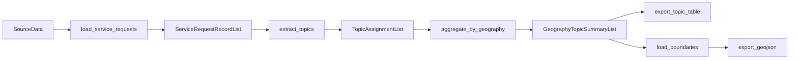

# Architecture

`nyc311` currently implements a narrow but end-to-end pipeline for deterministic
topic summarization over NYC 311-style complaint data.

## Pipeline

## Module Responsibilities

| Module | Responsibility |
| --- | --- |
| `nyc311.models` | Typed dataclasses and package-level constants |
| `nyc311.loaders` | CSV and Socrata ingestion, filter application, boundary-loading entry point |
| `nyc311.processors` | Deterministic topic extraction and geography aggregation |
| `nyc311.exporters` | CSV and GeoJSON output generation |
| `nyc311.boundaries` | GeoJSON parsing into boundary models |
| `nyc311.pipeline` | High-level SDK helper that mirrors the CLI happy path |
| `nyc311.cli` | Argparse-powered fetch and analysis entry points |

## Design Principles

- Keep the implemented surface honest and narrow.
- Prefer typed inputs and outputs over implicit dictionaries.
- Make the SDK composable for workflows and notebooks.
- Keep the CLI thin by delegating real work to importable functions.
- Leave planned surface area visible without pretending it is built.

## Implemented Vs Planned

### Implemented

- service-request loading from CSV and Socrata
- service-request snapshot export for reproducible local staging
- topic extraction for four supported complaint types
- aggregation by borough or community district
- CSV export
- boundary-backed GeoJSON export
- a one-call SDK pipeline helper
- thin CLI fetch and export paths

### Planned

- anomaly detection
- richer resolution-gap analysis and reporting
- report-card outputs
- broader CLI coverage

The repository includes `scripts/audit_implementation.py` to summarize the
current public surface and classify implemented versus planned symbols.

## Boundaries

GeoJSON export is intentionally narrow today. Boundary files must provide
feature properties with both:

- `geography`
- `geography_value`

This keeps export behavior deterministic without adding a larger spatial join
layer yet.

## Maintainer Notes

- `docs/og-context/` contains archived planning and original product framing.
- The primary source of truth for public package behavior is the tested code in
  `src/nyc311/` and the user-facing docs in this folder.
