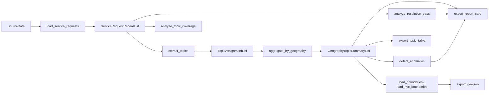

# Architecture

`nyc311` currently implements a narrow but end-to-end pipeline for deterministic
topic summarization over NYC 311-style complaint data.

This architecture snapshot reflects the current `0.2` alpha prerelease line.

## Pipeline

## Module Responsibilities

| Module              | Responsibility                                                              |
| ------------------- | --------------------------------------------------------------------------- |
| `nyc311.models`     | Typed dataclasses and package-level constants                               |
| `nyc311.loaders`    | CSV and Socrata ingestion, filter application, boundary-loading entry point |
| `nyc311.geographies` | Packaged NYC boundary layers, sample loaders, and geography conversions     |
| `nyc311.processors` | Deterministic topic extraction and geography aggregation                    |
| `nyc311.exporters`  | CSV and GeoJSON output generation                                           |
| `nyc311.boundaries` | GeoJSON parsing into boundary models                                        |
| `nyc311.plotting`   | Optional in-memory plotting helpers for packaged boundary layers            |
| `nyc311.pipeline`   | High-level SDK helper that mirrors the CLI happy path                       |
| `nyc311.cli`        | Argparse-powered fetch and analysis entry points                            |

## Design Principles

- Keep the implemented surface honest and narrow.
- Prefer typed inputs and outputs over implicit dictionaries.
- Make the SDK composable for workflows and notebooks.
- Ship turnkey NYC geography layers as library-owned packaged resources.
- Keep the CLI thin by delegating real work to importable functions.
- Keep optional dependency boundaries explicit for dataframe and notebook
  helpers.

## Implemented Scope

- service-request loading from CSV and Socrata
- service-request snapshot export for reproducible local staging
- topic extraction for four supported complaint types
- topic-coverage analysis for descriptor-rule match rates
- aggregation by borough or community district
- resolution-gap summaries
- anomaly detection over aggregated topic counts
- CSV export
- boundary-backed GeoJSON export
- markdown report-card export
- optional pandas dataframe conversion helpers
- packaged NYC borough, community-district, council-district, NTA, ZCTA, and census-tract boundary layers
- packaged sample service-request and boundary loaders for notebook workflows
- optional in-memory boundary plotting helpers
- a one-call SDK pipeline helper
- thin CLI fetch and export paths

The repository includes `scripts/audit_implementation.py` to summarize the
current public surface and keep docs aligned with shipped behavior. Planned
symbols are declared in `src/nyc311/planned_surface.json` rather than as dead
runtime placeholders.

## Boundaries

Boundary-backed exports still expect feature properties with both:

- `geography`
- `geography_value`

`nyc311` now also ships packaged, library-owned canonical boundary layers for:

- `borough`
- `community_district`
- `council_district`
- `neighborhood_tabulation_area`
- `zcta`
- `census_tract`

These packaged layers are the preferred notebook and SDK path. File-backed
boundary loading remains available for scripts and custom workflows.

## Maintainer Notes

The primary source of truth for public package behavior is the tested code in
`src/nyc311/` and the user-facing docs in this folder.
