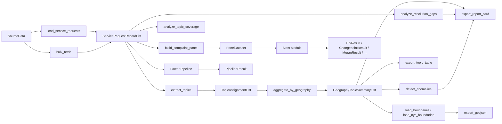
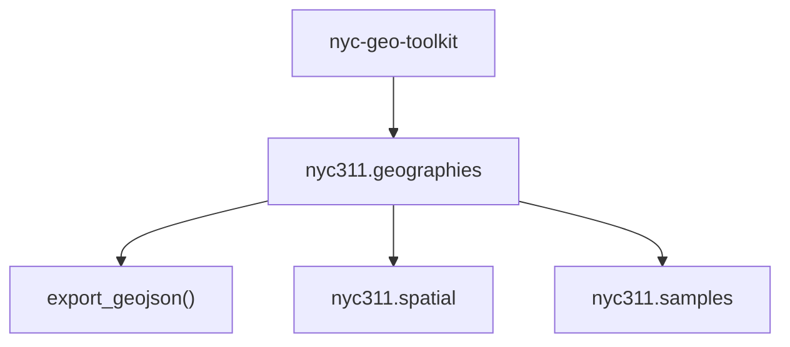

# Architecture

`nyc311` implements a narrow but end-to-end pipeline for deterministic topic
summarization over NYC 311-style complaint data.

This architecture snapshot reflects the current stable `0.3.x` release surface.

## Pipeline

## Module Responsibilities

| Module               | Responsibility                                                                                                                                                                                                                               |
| -------------------- | -------------------------------------------------------------------------------------------------------------------------------------------------------------------------------------------------------------------------------------------- |
| `nyc311.models`      | Typed dataclasses, constants, configs, and normalization helpers                                                                                                                                                                             |
| `nyc311.io`          | CSV and Socrata ingestion for service-request records                                                                                                                                                                                        |
| `nyc311.analysis`    | Deterministic topic extraction, coverage, gaps, and anomalies                                                                                                                                                                                |
| `nyc311.geographies` | Compatibility layer over `nyc-geo-toolkit` plus 311-specific geography adapters                                                                                                                                                              |
| `nyc311.samples`     | Packaged sample records and sample-aligned boundary subsets                                                                                                                                                                                  |
| `nyc311.export`      | CSV, GeoJSON, and markdown artifact generation                                                                                                                                                                                               |
| `nyc311.dataframes`  | Optional pandas conversions for typed nyc311 models                                                                                                                                                                                          |
| `nyc311.spatial`     | Optional geopandas spatial helpers and joins                                                                                                                                                                                                 |
| `nyc311.plotting`    | Optional in-memory plotting helpers for packaged boundary layers                                                                                                                                                                             |
| `nyc311.presets`     | Reusable filter and Socrata config builders for common workflows                                                                                                                                                                             |
| `nyc311.pipeline`    | High-level SDK helpers that mirror the CLI happy path                                                                                                                                                                                        |
| `nyc311.factors`     | Composable factor pipeline with 9 built-in factors including SpatialLagFactor and EquityGapFactor                                                                                                                                            |
| `nyc311.temporal`    | Balanced panel datasets, treatment events, and inverse-distance spatial weights                                                                                                                                                              |
| `nyc311.stats`       | Statistical modeling: ITS, PELT, STL, panel FE/RE, Moran/LISA, synthetic control, staggered DiD, event study, RDD, spatial lag/error, GWR, Oaxaca-Blinder, Theil, reporting-bias adjustment, BYM2, Hawkes, anomaly detection, power analysis |
| `nyc311.cli`         | Argparse-powered fetch and analysis entry points                                                                                                                                                                                             |

## Design Principles

- Keep the implemented surface explicit and namespaced.
- Prefer typed inputs and outputs over implicit dictionaries.
- Make the SDK composable for scripts, workflows, and interactive analysis.
- Expose packaged geography access through a thin compatibility layer over
  `nyc-geo-toolkit`.
- Keep the CLI thin by delegating real work to importable functions.
- Keep optional dependency boundaries explicit for dataframe, spatial, and
  notebook helpers.
- Provide publication-quality statistical methods with clear academic references
  for every modeling primitive.

## Toolkit Relationship

`nyc311` owns the 311-specific workflow, while `nyc-geo-toolkit` owns the
generic NYC geography assets and normalization rules.

That split keeps the package responsibilities clear:

- `nyc311` owns complaint loading, topic analysis, exports, reports, and
  package-specific compatibility helpers
- `nyc-geo-toolkit` owns reusable boundary data, canonical geography
  normalization, and generic boundary loaders
- consumer-facing geography helpers in `nyc311` stay thin so they can track the
  stable toolkit contract without duplicating shared implementation

## Implemented Scope

- service-request loading from CSV and Socrata
- service-request snapshot export for reproducible local staging
- topic extraction for four supported complaint types
- topic-coverage analysis for descriptor-rule match rates
- aggregation by borough or community district
- resolution-gap summaries
- anomaly detection over aggregated topic counts
- CSV export
- boundary-backed GeoJSON export
- markdown report-card export
- optional pandas dataframe conversion helpers
- packaged NYC borough, community-district, council-district, NTA, ZCTA, and
  census-tract boundary layers
- packaged sample service-request and boundary loaders for example workflows
- optional in-memory boundary plotting helpers
- a one-call SDK pipeline helper
- thin CLI fetch and export paths
- a namespace-based public API audit script for maintainers
- a composable factor pipeline with nine built-in domain factors (including
  SpatialLagFactor and EquityGapFactor)
- a balanced temporal panel builder with treatment-event modeling and
  inverse-distance spatial weights
- a statistics module with interrupted time series, PELT changepoint detection,
  STL seasonal decomposition, Moran's I / LISA spatial autocorrelation, panel
  fixed/random-effects regression wrappers, synthetic control, staggered
  difference-in-differences, event-study plots, regression discontinuity,
  spatial lag/error models, GWR, Oaxaca-Blinder decomposition, Theil index,
  reporting-bias adjustment, BYM2 small-area smoothing, Hawkes process,
  seasonality-adjusted anomaly detection, and power analysis / MDE calculator
- a `bulk_fetch()` per-borough downloader that emits `.meta.json` integrity
  sidecars
- the resolution-equity case study, which exercises the full v0.3.0 surface
  against ~1M real records

## Boundaries

Boundary-backed exports still expect feature properties with both:

- `geography`
- `geography_value`

`nyc311` now consumes canonical packaged boundary layers from `nyc-geo-toolkit`
for:

- `borough`
- `community_district`
- `council_district`
- `neighborhood_tabulation_area`
- `zcta`
- `census_tract`

These packaged layers are the preferred notebook and SDK path. File-backed
boundary loading remains available through
`nyc311.geographies.load_boundaries()` for scripts and custom workflows, while
the generic boundary assets and normalization logic live in `nyc-geo-toolkit`.

## Maintainer Notes

The primary source of truth for public package behavior is the tested code in
`src/nyc311/` and the user-facing docs in this folder.
