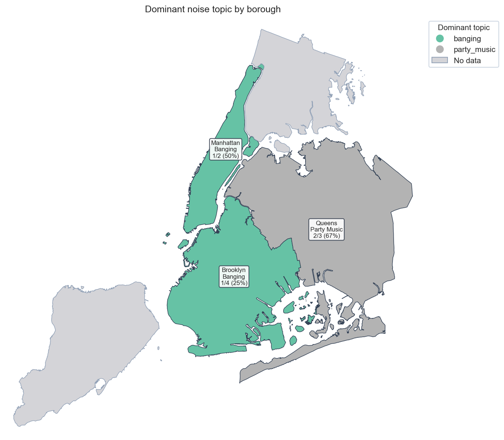
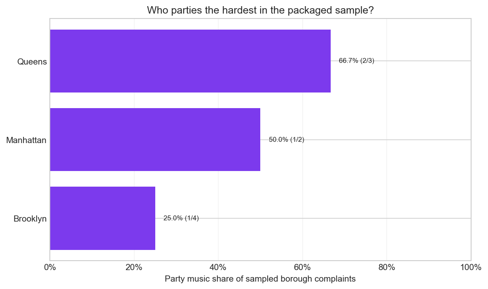
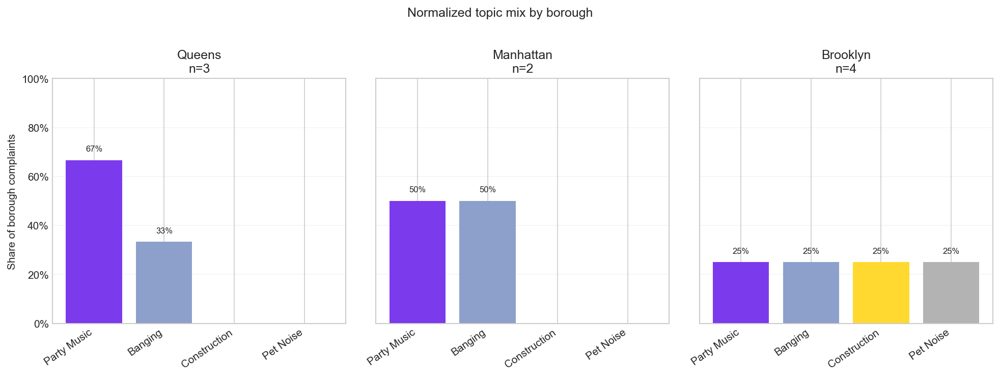

# Borough Choropleth Tearsheet

This tearsheet summarizes the packaged `Noise - Residential` sample at the
borough level. All shares are normalized within borough and should be read as
sample intensity, not citywide prevalence.

## Executive Summary

- The packaged sample contains `9` noise complaints across `3` boroughs.
- Queens shows the strongest party-music intensity at `66.7%` (2 of 3
  complaints).
- Brooklyn shows the weakest party-music intensity at `25.0%` (1 of 4
  complaints).
- The sharpest single-topic signal appears in `Queens`, where `Party Music`
  accounts for `66.7%` (2 of 3).
- The flattest topic mix appears in `Brooklyn`, where the leading topic accounts
  for only `25.0%` (1 of 4).
- No sample records are available for `Bronx and Staten Island`.

## Borough Dominant Topic Map

## Party Music Intensity

## Topic Mix By Borough

## Borough Metrics

| Borough       | Total complaints | Party music count | Party music share | Dominant topic | Dominant share |
| ------------- | ---------------- | ----------------- | ----------------- | -------------- | -------------- |
| Queens        | 3                | 2                 | 66.7%             | Party Music    | 66.7%          |
| Manhattan     | 2                | 1                 | 50.0%             | Banging        | 50.0%          |
| Brooklyn      | 4                | 1                 | 25.0%             | Banging        | 25.0%          |
| Bronx         | 0                | 0                 | n/a               | No sample data | n/a            |
| Staten Island | 0                | 0                 | n/a               | No sample data | n/a            |
