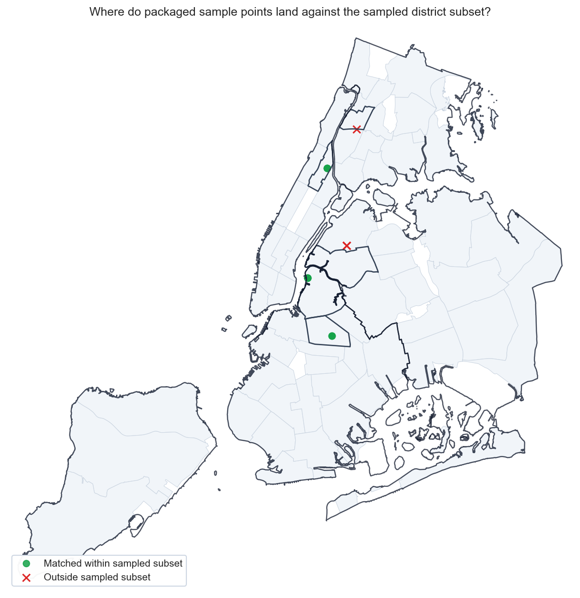
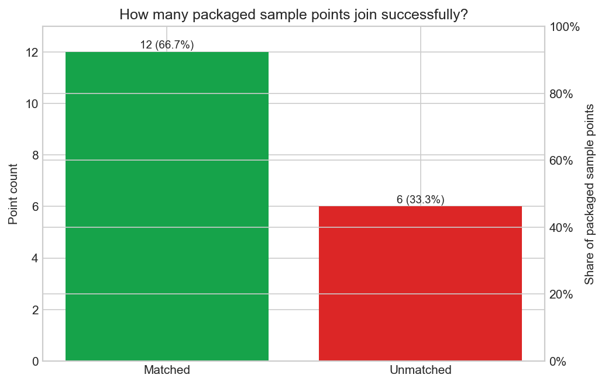

# Boundary QA Tearsheet

This tearsheet audits the packaged sample points against the packaged
`community_district` boundary layer. Treat the metrics here as a geometry
sanity check for the sample assets, not a citywide production coverage test.

## Executive Summary

- The packaged sample contains `18` point-capable service requests and `5` packaged sample-aligned polygons.
- Spatial join coverage is `66.7%` with `12` matched points and `6` unmatched points.
- Raw district text agrees with the spatial join for `100.0%` of matched rows (`12` of `12`).
- The following packaged polygons receive no matched sample points: `BRONX 05, QUEENS 02`.
- Scratch QA tables are available at `boundary-unmatched-points.csv` and `boundary-text-vs-spatial.csv` under `artifacts/`.

## Match Status Map

## Coverage Breakdown

## Boundary Geometry Inventory

| Boundary | Geometry type | Matched point count |
| --- | --- | --- |
| MANHATTAN 10 | MultiPolygon | 4 |
| BRONX 05 | MultiPolygon | 0 |
| BROOKLYN 01 | MultiPolygon | 5 |
| BROOKLYN 03 | MultiPolygon | 3 |
| QUEENS 02 | MultiPolygon | 0 |

## Text vs Spatial Agreement

The detailed agreement table lives in `artifacts/`, but the summary rule is
simple: compare the raw `community_district` text on each record with the
joined `boundary_geography_value` after the spatial overlay.

| Metric | Value |
| --- | --- |
| Matched rows | 12 |
| Unmatched rows | 6 |
| Agreement rows | 12 |
| Agreement rate among matched rows | 100.0% |
