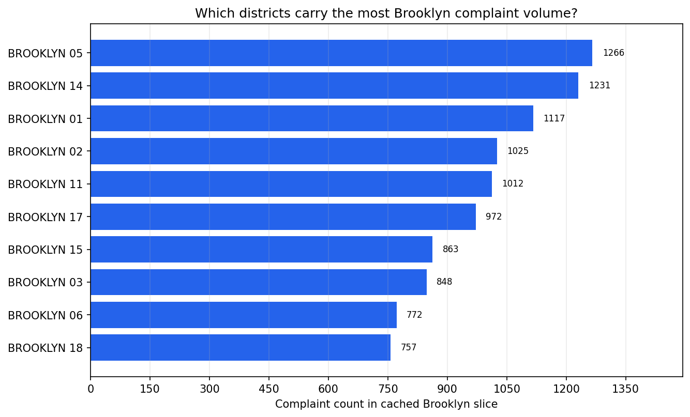
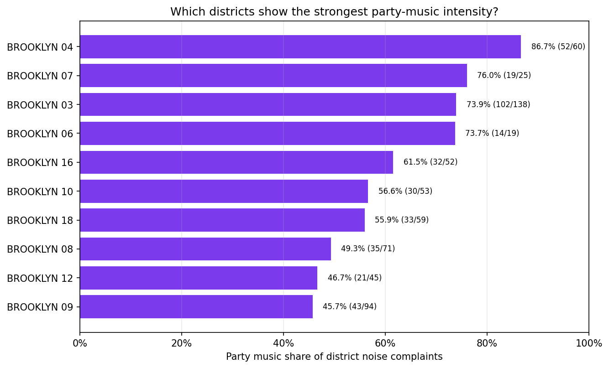
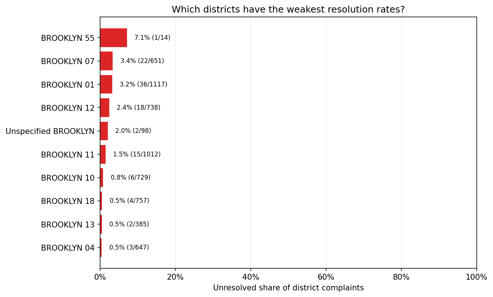

# Community District Case Study Tearsheet

This tearsheet summarizes a cached Brooklyn slice and focuses on community
district volume, normalized residential-noise topics, and resolution gaps.
Refresh the cache and republish only when you intentionally want to update the
tracked report assets.

## Executive Summary

- The cached slice contains `15000` complaint records across `20` community
  districts.
- The largest complaint category is `Illegal Parking` with `3264` records (21.8%
  of the slice).
- The busiest district is `BROOKLYN 05` with `1266` complaints.
- The strongest party-music intensity appears in `BROOKLYN 04`, where party
  music accounts for `86.7%` of sampled residential-noise complaints.
- The weakest district-level resolution rate appears in `BROOKLYN 55`, where
  `7.1%` of complaints remain unresolved.
- The complaint group with the weakest overall resolution rate is
  `Construction Lead Dust` at `100.0%` unresolved.
- Report source: `live fetch` using cache file `cache/brooklyn-case-study.csv`.

## District Volume

## Party Music Intensity

## Resolution Gap Comparison

## Top Complaint Types

| Complaint type           | Count | Share of slice |
| ------------------------ | ----- | -------------- |
| Illegal Parking          | 3264  | 21.8%          |
| HEAT/HOT WATER           | 2585  | 17.2%          |
| Noise - Residential      | 1414  | 9.4%           |
| Blocked Driveway         | 907   | 6.0%           |
| UNSANITARY CONDITION     | 446   | 3.0%           |
| Abandoned Vehicle        | 329   | 2.2%           |
| PLUMBING                 | 297   | 2.0%           |
| Dirty Condition          | 282   | 1.9%           |
| Street Condition         | 260   | 1.7%           |
| Traffic Signal Condition | 236   | 1.6%           |

## District Metrics

| District    | Total complaints | Dominant noise topic | Dominant share | Party music share | Resolution rate |
| ----------- | ---------------- | -------------------- | -------------- | ----------------- | --------------- |
| BROOKLYN 04 | 647              | Party Music          | 86.7%          | 86.7%             | 99.5%           |
| BROOKLYN 07 | 651              | Party Music          | 76.0%          | 76.0%             | 96.6%           |
| BROOKLYN 03 | 848              | Party Music          | 73.9%          | 73.9%             | 99.9%           |
| BROOKLYN 06 | 772              | Party Music          | 73.7%          | 73.7%             | 100.0%          |
| BROOKLYN 16 | 468              | Party Music          | 61.5%          | 61.5%             | 99.8%           |
| BROOKLYN 10 | 729              | Party Music          | 56.6%          | 56.6%             | 99.2%           |
| BROOKLYN 18 | 757              | Party Music          | 55.9%          | 55.9%             | 99.5%           |
| BROOKLYN 08 | 738              | Party Music          | 49.3%          | 49.3%             | 99.7%           |
| BROOKLYN 12 | 738              | Banging              | 48.9%          | 46.7%             | 97.6%           |
| BROOKLYN 09 | 669              | Banging              | 50.0%          | 45.7%             | 99.7%           |

## Resolution Hotspots

| District             | Unresolved count | Total complaints | Unresolved share |
| -------------------- | ---------------- | ---------------- | ---------------- |
| BROOKLYN 55          | 1                | 14               | 7.1%             |
| BROOKLYN 07          | 22               | 651              | 3.4%             |
| BROOKLYN 01          | 36               | 1117             | 3.2%             |
| BROOKLYN 12          | 18               | 738              | 2.4%             |
| Unspecified BROOKLYN | 2                | 98               | 2.0%             |
| BROOKLYN 11          | 15               | 1012             | 1.5%             |
| BROOKLYN 10          | 6                | 729              | 0.8%             |
| BROOKLYN 18          | 4                | 757              | 0.5%             |
| BROOKLYN 13          | 2                | 385              | 0.5%             |
| BROOKLYN 04          | 3                | 647              | 0.5%             |
