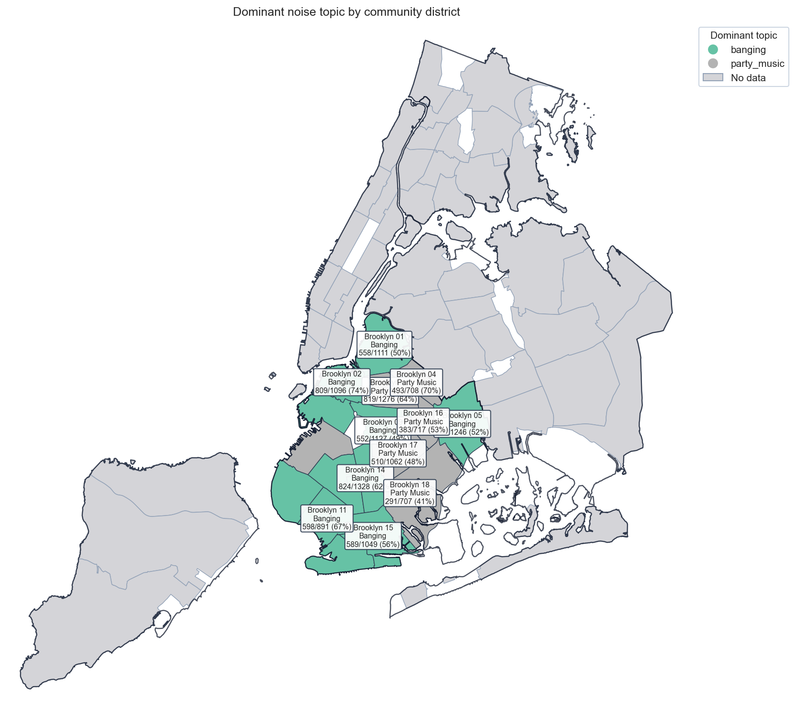
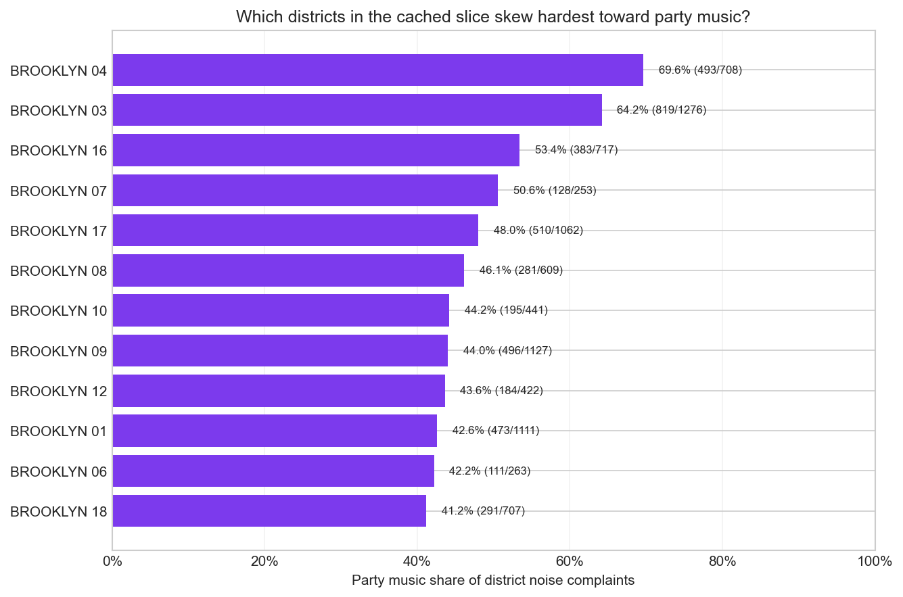
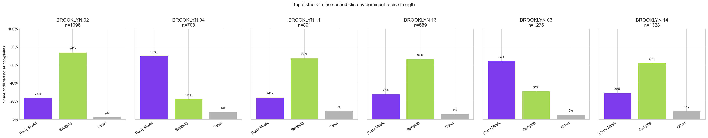

# Community District Choropleth Tearsheet

This tearsheet summarizes a cached live `Noise - Residential` slice at the
community-district level. The map uses the full NYC district layer so grey
polygons show where the cached slice has no district-level coverage.

## Executive Summary

- The cached slice contains `15000` noise complaints from `live fetch` using
  `cache/community-district-noise-snapshot.csv` across `18` sampled districts.
- The strongest party-music intensity appears in `BROOKLYN 04` at `69.6%` (493
  of 708).
- The sharpest dominant-topic signal appears in `BROOKLYN 02`, where `Banging`
  accounts for `73.8%` of cached district noise.
- The flattest topic mix appears in `BROOKLYN 18`, where the leading topic
  reaches only `41.2%`.
- The full district layer contains `41` no-data polygons that do not appear in
  the cached slice.

## Dominant Topic Map

## Party Music Intensity

## Topic Mix Snapshot

## District Metrics

| District    | Total complaints | Party music share | Dominant topic | Dominant share |
| ----------- | ---------------- | ----------------- | -------------- | -------------- |
| BROOKLYN 04 | 708              | 69.6%             | Party Music    | 69.6%          |
| BROOKLYN 03 | 1276             | 64.2%             | Party Music    | 64.2%          |
| BROOKLYN 16 | 717              | 53.4%             | Party Music    | 53.4%          |
| BROOKLYN 07 | 253              | 50.6%             | Party Music    | 50.6%          |
| BROOKLYN 17 | 1062             | 48.0%             | Party Music    | 48.0%          |
| BROOKLYN 08 | 609              | 46.1%             | Banging        | 48.1%          |
| BROOKLYN 10 | 441              | 44.2%             | Banging        | 44.9%          |
| BROOKLYN 09 | 1127             | 44.0%             | Banging        | 49.0%          |
| BROOKLYN 12 | 422              | 43.6%             | Banging        | 51.4%          |
| BROOKLYN 01 | 1111             | 42.6%             | Banging        | 50.2%          |
| BROOKLYN 06 | 263              | 42.2%             | Banging        | 42.6%          |
| BROOKLYN 18 | 707              | 41.2%             | Party Music    | 41.2%          |
| BROOKLYN 05 | 1246             | 36.1%             | Banging        | 51.9%          |
| BROOKLYN 14 | 1328             | 29.2%             | Banging        | 62.0%          |
| BROOKLYN 13 | 689              | 27.4%             | Banging        | 66.6%          |
