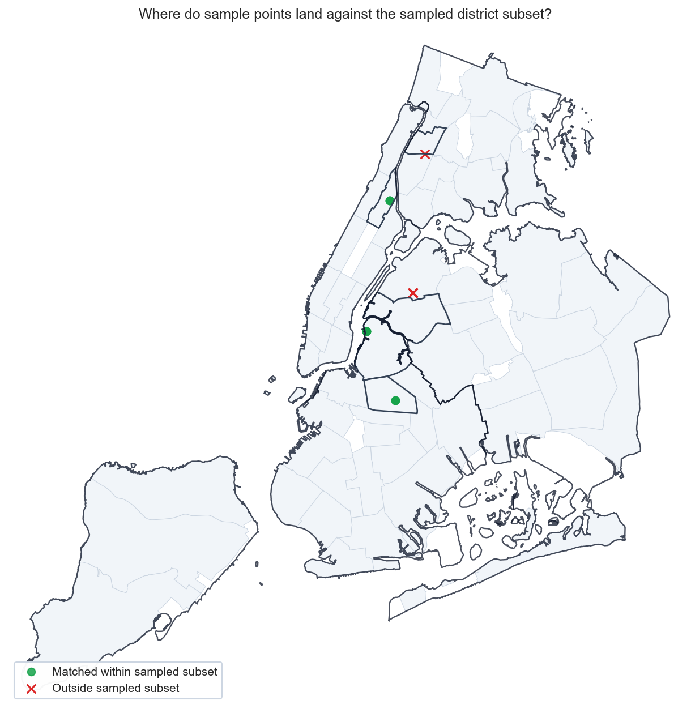
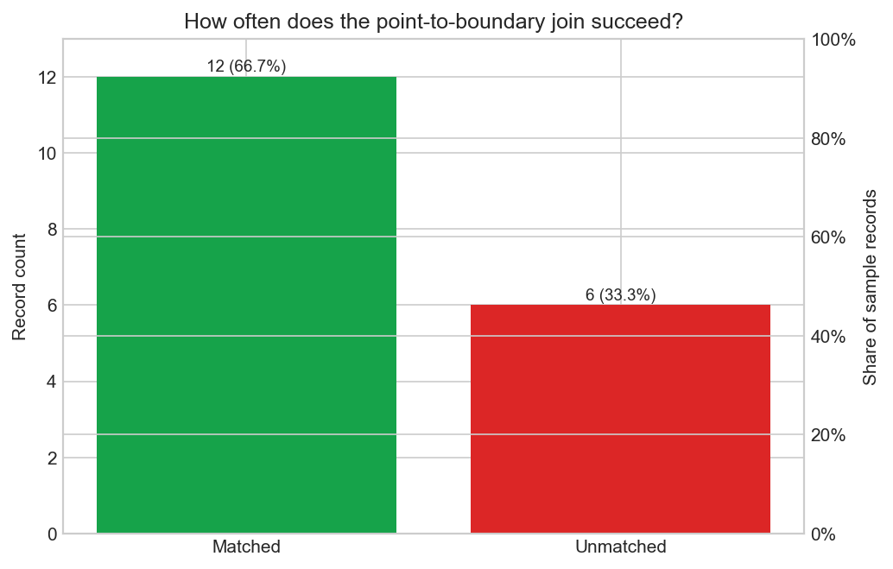
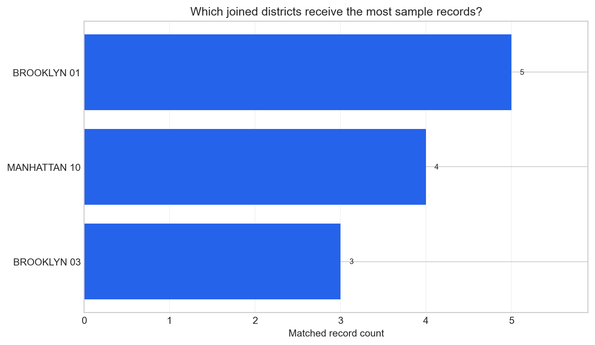

# Point To Boundary Join Tearsheet

This tearsheet summarizes a raw point-in-polygon join from the packaged
sample service requests onto the packaged community-district boundaries.

## Executive Summary

- The packaged sample contains `18` point-capable records and the spatial join succeeds for `12` of them (`66.7%`).
- `6` records remain outside every polygon in the packaged sample-aligned boundary subset.
- Raw district text agrees with the spatial assignment for `100.0%` of matched rows (`12` of `12`).
- The busiest joined polygon is `BROOKLYN 01` with `5` matched records.

## Match Status Map

## Join Success Rate

## Joined District Counts

## Joined District Metrics

| Joined district | Matched count |
| --- | --- |
| BROOKLYN 01 | 5 |
| MANHATTAN 10 | 4 |
| BROOKLYN 03 | 3 |

## Agreement Summary

| Metric | Value |
| --- | --- |
| Matched rows | 12 |
| Unmatched rows | 6 |
| Agreement rows | 12 |
| Agreement rate among matched rows | 100.0% |
