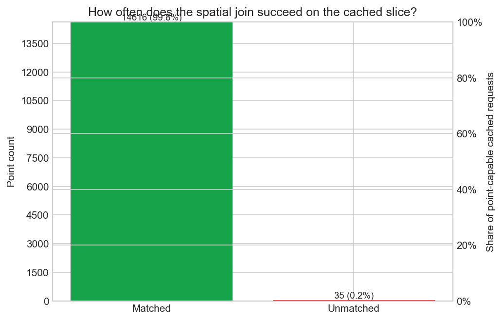
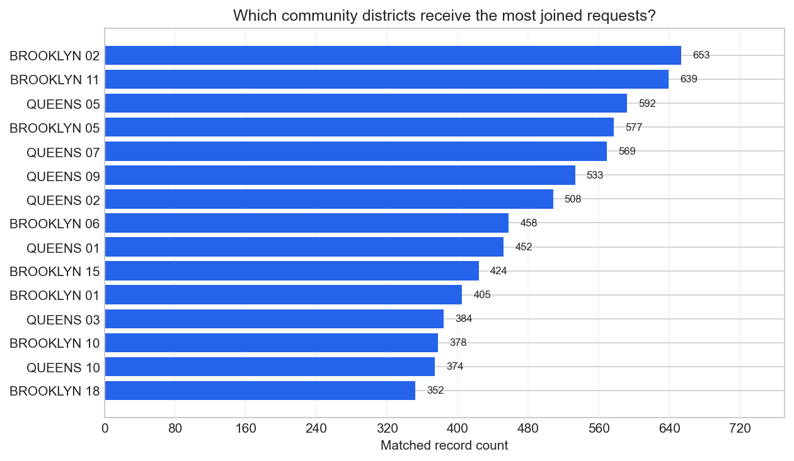

# Spatial Join QA Tearsheet

This canonical example audits a cached live 311 slice against the full NYC
community-district layer, then turns the result into one QA report covering join
success, unmatched rows, district coverage, and raw-vs-spatial agreement.

## Executive Summary

- The cached slice contains `15000` requests from `live fetch` using
  `cache/spatial-join-qa-snapshot.csv`. `14651` of those rows carry usable
  coordinates for point-in-polygon QA.
- The largest complaint group in the QA slice is `Illegal Parking` with `8944`
  rows (59.6% of the slice).
- The spatial join succeeds for `14616` of the `14651` point-capable rows
  (`99.8%`).
- `35` rows remain outside every polygon in the district layer.
- Raw district text agrees with the spatial join for `99.5%` of matched rows
  (`14541` of `14616`).
- `59` of `59` community districts receive at least one joined request.
- Every district polygon receives at least one matched point.
- The busiest joined district is `BROOKLYN 02` with `653` matched records.

## Match Status Map

## Coverage Breakdown

## Joined District Counts

## Complaint Mix

| Complaint type           | Count | Share of cached slice |
| ------------------------ | ----- | --------------------- |
| Illegal Parking          | 8944  | 59.6%                 |
| Blocked Driveway         | 2991  | 19.9%                 |
| Street Condition         | 1213  | 8.1%                  |
| Abandoned Vehicle        | 1091  | 7.3%                  |
| Traffic Signal Condition | 761   | 5.1%                  |

## Joined District Metrics

| District    | Matched count |
| ----------- | ------------- |
| BROOKLYN 02 | 653           |
| BROOKLYN 11 | 639           |
| QUEENS 05   | 592           |
| BROOKLYN 05 | 577           |
| QUEENS 07   | 569           |
| QUEENS 09   | 533           |
| QUEENS 02   | 508           |
| BROOKLYN 06 | 458           |
| QUEENS 01   | 452           |
| BROOKLYN 15 | 424           |
| BROOKLYN 01 | 405           |
| QUEENS 03   | 384           |
| BROOKLYN 10 | 378           |
| QUEENS 10   | 374           |
| BROOKLYN 18 | 352           |

## Boundary Geometry Inventory

| Boundary         | Geometry type | Matched point count |
| ---------------- | ------------- | ------------------- |
| MANHATTAN 01     | MultiPolygon  | 121                 |
| MANHATTAN 02     | MultiPolygon  | 63                  |
| MANHATTAN 03     | MultiPolygon  | 130                 |
| MANHATTAN 04     | MultiPolygon  | 130                 |
| MANHATTAN 05     | MultiPolygon  | 146                 |
| MANHATTAN 06     | MultiPolygon  | 72                  |
| MANHATTAN 07     | MultiPolygon  | 119                 |
| MANHATTAN 08     | MultiPolygon  | 132                 |
| MANHATTAN 09     | MultiPolygon  | 145                 |
| MANHATTAN 10     | MultiPolygon  | 108                 |
| MANHATTAN 11     | MultiPolygon  | 88                  |
| MANHATTAN 12     | MultiPolygon  | 183                 |
| BRONX 01         | MultiPolygon  | 96                  |
| BRONX 02         | MultiPolygon  | 63                  |
| BRONX 03         | MultiPolygon  | 61                  |
| BRONX 04         | MultiPolygon  | 130                 |
| BRONX 05         | MultiPolygon  | 130                 |
| BRONX 06         | MultiPolygon  | 72                  |
| BRONX 07         | MultiPolygon  | 187                 |
| BRONX 08         | MultiPolygon  | 244                 |
| BRONX 09         | MultiPolygon  | 172                 |
| BRONX 10         | MultiPolygon  | 189                 |
| BRONX 11         | MultiPolygon  | 219                 |
| BRONX 12         | MultiPolygon  | 296                 |
| BROOKLYN 01      | MultiPolygon  | 405                 |
| BROOKLYN 02      | MultiPolygon  | 653                 |
| BROOKLYN 03      | MultiPolygon  | 156                 |
| BROOKLYN 04      | MultiPolygon  | 161                 |
| BROOKLYN 05      | MultiPolygon  | 577                 |
| BROOKLYN 06      | MultiPolygon  | 458                 |
| BROOKLYN 07      | MultiPolygon  | 228                 |
| BROOKLYN 08      | MultiPolygon  | 201                 |
| BROOKLYN 09      | MultiPolygon  | 128                 |
| BROOKLYN 10      | MultiPolygon  | 378                 |
| BROOKLYN 11      | MultiPolygon  | 639                 |
| BROOKLYN 12      | MultiPolygon  | 322                 |
| BROOKLYN 13      | MultiPolygon  | 152                 |
| BROOKLYN 14      | MultiPolygon  | 297                 |
| BROOKLYN 15      | MultiPolygon  | 424                 |
| BROOKLYN 16      | MultiPolygon  | 76                  |
| BROOKLYN 17      | MultiPolygon  | 190                 |
| BROOKLYN 18      | MultiPolygon  | 352                 |
| QUEENS 01        | MultiPolygon  | 452                 |
| QUEENS 02        | MultiPolygon  | 508                 |
| QUEENS 03        | MultiPolygon  | 384                 |
| QUEENS 04        | MultiPolygon  | 265                 |
| QUEENS 05        | MultiPolygon  | 592                 |
| QUEENS 06        | MultiPolygon  | 146                 |
| QUEENS 07        | MultiPolygon  | 569                 |
| QUEENS 08        | MultiPolygon  | 259                 |
| QUEENS 09        | MultiPolygon  | 533                 |
| QUEENS 10        | MultiPolygon  | 374                 |
| QUEENS 11        | MultiPolygon  | 238                 |
| QUEENS 12        | MultiPolygon  | 350                 |
| QUEENS 13        | MultiPolygon  | 248                 |
| QUEENS 14        | MultiPolygon  | 109                 |
| STATEN ISLAND 01 | MultiPolygon  | 224                 |
| STATEN ISLAND 02 | MultiPolygon  | 124                 |
| STATEN ISLAND 03 | MultiPolygon  | 148                 |

## Agreement Summary

Scratch QA tables are available under `artifacts/`:
`spatial-join-qa-complaint-mix.csv`, `spatial-join-qa-unmatched-points.csv`,
`spatial-join-qa-text-vs-spatial.csv`, and
`spatial-join-qa-joined-district-counts.csv`.

| Metric                            | Value |
| --------------------------------- | ----- |
| Cached rows                       | 15000 |
| Point-capable rows                | 14651 |
| Matched rows                      | 14616 |
| Unmatched rows                    | 35    |
| Agreement rows                    | 14541 |
| Agreement rate among matched rows | 99.5% |
