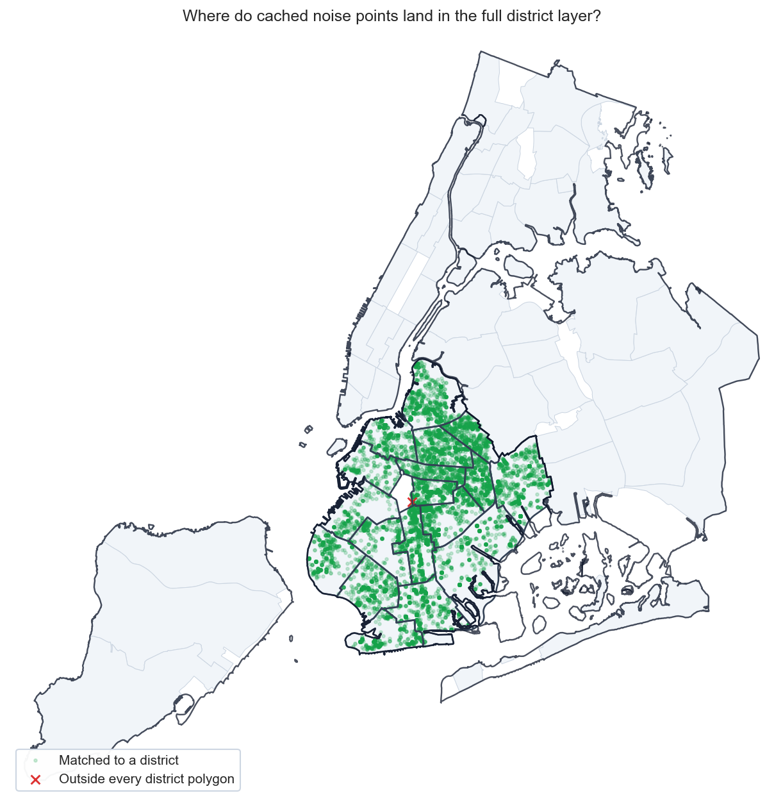
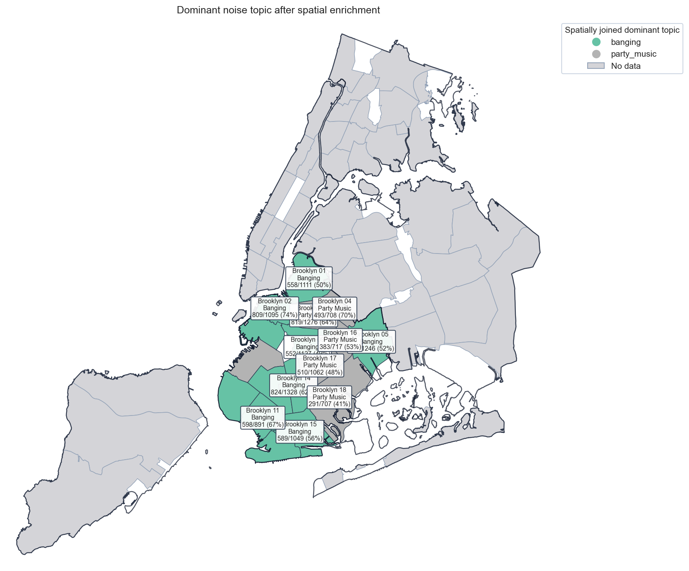
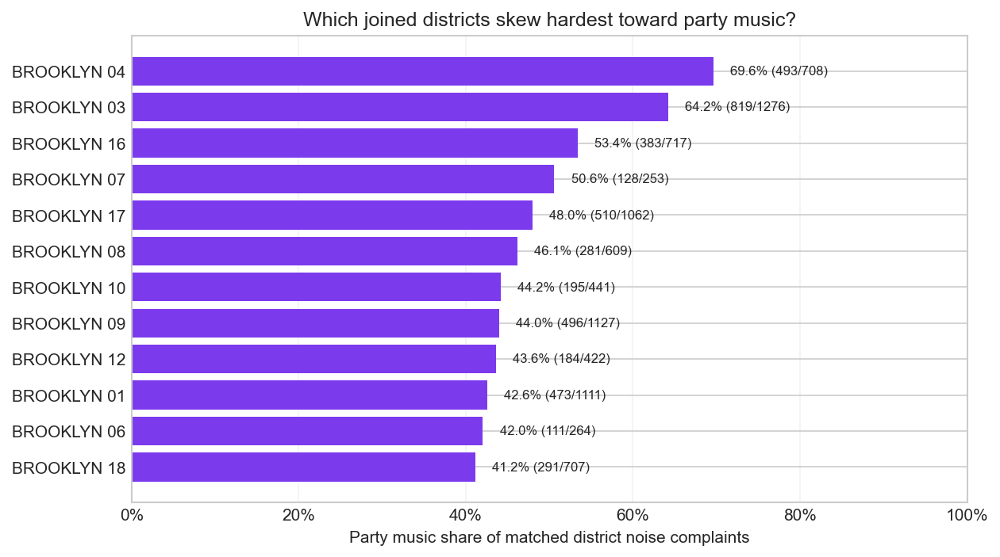
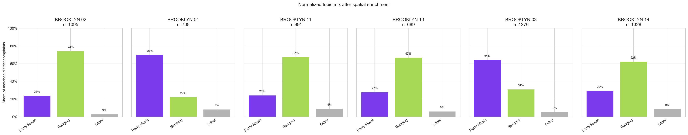

# Spatial Topic Comparison Tearsheet

This tearsheet compares residential-noise topics before and after spatially
joining a cached live noise slice to the full NYC community-district layer.

## Executive Summary

- The cached slice contributes `14996` residential-noise points from `live fetch` using `cache/spatial-topic-comparison-noise-snapshot.csv`, and `14995` of them land inside a district polygon when the full layer is used.
- The strongest party-music intensity after the spatial join appears in `BROOKLYN 04` at `69.6%`.
- The sharpest dominant-topic signal appears in `BROOKLYN 02`, where `Banging` reaches `73.9%`.
- The most balanced joined district is `BROOKLYN 18`, where the leading topic reaches only `41.2%`.
- Spatial enrichment changes the raw district label for `1` rows in the cached slice, which is why this example reports both raw and spatial district views.

## Spatial Join Preview

## Dominant Topic Map

## Party Music Intensity

## Topic Mix By Joined District

## Raw vs Spatial District Summary

| View | District | Total complaints | Dominant topic | Dominant share | Party music share |
| --- | --- | --- | --- | --- | --- |
| Raw record label | BROOKLYN 14 | 1328 | Banging | 62.0% | 29.2% |
| Raw record label | BROOKLYN 03 | 1276 | Party Music | 64.2% | 64.2% |
| Raw record label | BROOKLYN 05 | 1246 | Banging | 51.9% | 36.1% |
| Raw record label | BROOKLYN 09 | 1127 | Banging | 49.0% | 44.0% |
| Raw record label | BROOKLYN 01 | 1111 | Banging | 50.2% | 42.6% |
| Raw record label | BROOKLYN 02 | 1096 | Banging | 73.8% | 23.5% |
| Raw record label | BROOKLYN 17 | 1062 | Party Music | 48.0% | 48.0% |
| Raw record label | BROOKLYN 15 | 1049 | Banging | 56.1% | 22.7% |
| Raw record label | BROOKLYN 11 | 891 | Banging | 67.1% | 23.9% |
| Raw record label | BROOKLYN 16 | 717 | Party Music | 53.4% | 53.4% |
| Spatial join | BROOKLYN 14 | 1328 | Banging | 62.0% | 29.2% |
| Spatial join | BROOKLYN 03 | 1276 | Party Music | 64.2% | 64.2% |
| Spatial join | BROOKLYN 05 | 1246 | Banging | 51.9% | 36.1% |
| Spatial join | BROOKLYN 09 | 1127 | Banging | 49.0% | 44.0% |
| Spatial join | BROOKLYN 01 | 1111 | Banging | 50.2% | 42.6% |
| Spatial join | BROOKLYN 02 | 1095 | Banging | 73.9% | 23.6% |
| Spatial join | BROOKLYN 17 | 1062 | Party Music | 48.0% | 48.0% |
| Spatial join | BROOKLYN 15 | 1049 | Banging | 56.1% | 22.7% |
| Spatial join | BROOKLYN 11 | 891 | Banging | 67.1% | 23.9% |
| Spatial join | BROOKLYN 16 | 717 | Party Music | 53.4% | 53.4% |

## Reassigned Rows

| Request ID | Raw district | Spatial district | Topic | Descriptor |
| --- | --- | --- | --- | --- |
| 63973732 | BROOKLYN 02 | BROOKLYN 06 | Other | Loud Talking |

## Joined District Metrics

| Joined district | Total complaints | Dominant topic | Dominant share | Party music share |
| --- | --- | --- | --- | --- |
| BROOKLYN 04 | 708 | Party Music | 69.6% | 69.6% |
| BROOKLYN 03 | 1276 | Party Music | 64.2% | 64.2% |
| BROOKLYN 16 | 717 | Party Music | 53.4% | 53.4% |
| BROOKLYN 07 | 253 | Party Music | 50.6% | 50.6% |
| BROOKLYN 17 | 1062 | Party Music | 48.0% | 48.0% |
| BROOKLYN 08 | 609 | Banging | 48.1% | 46.1% |
| BROOKLYN 10 | 441 | Banging | 44.9% | 44.2% |
| BROOKLYN 09 | 1127 | Banging | 49.0% | 44.0% |
| BROOKLYN 12 | 422 | Banging | 51.4% | 43.6% |
| BROOKLYN 01 | 1111 | Banging | 50.2% | 42.6% |
| BROOKLYN 06 | 264 | Banging | 42.4% | 42.0% |
| BROOKLYN 18 | 707 | Party Music | 41.2% | 41.2% |
| BROOKLYN 05 | 1246 | Banging | 51.9% | 36.1% |
| BROOKLYN 14 | 1328 | Banging | 62.0% | 29.2% |
| BROOKLYN 13 | 689 | Banging | 66.6% | 27.4% |
