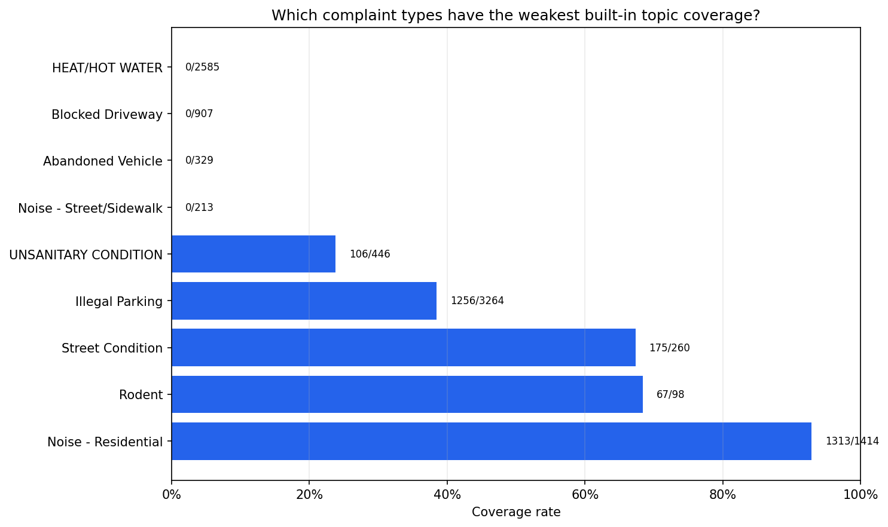
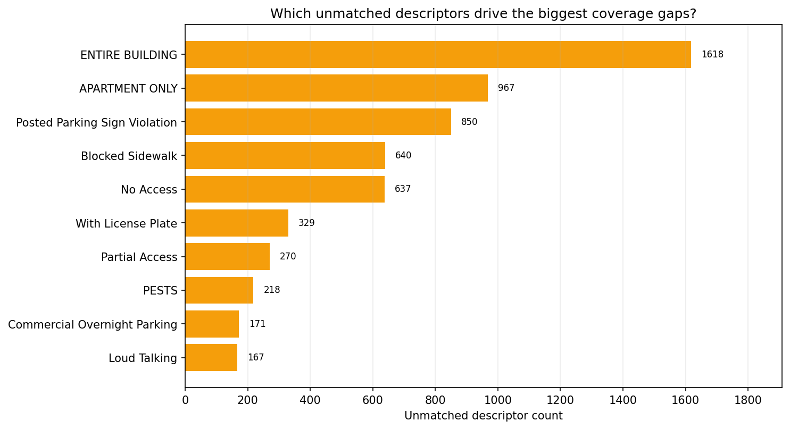
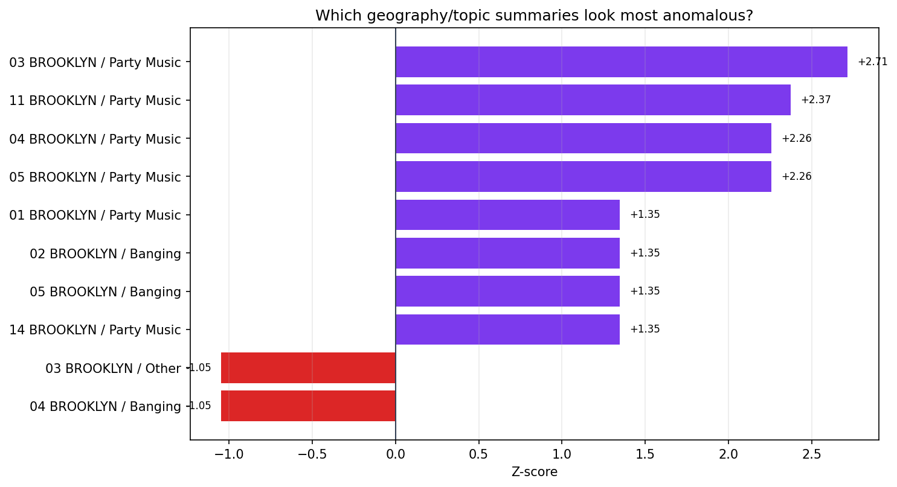
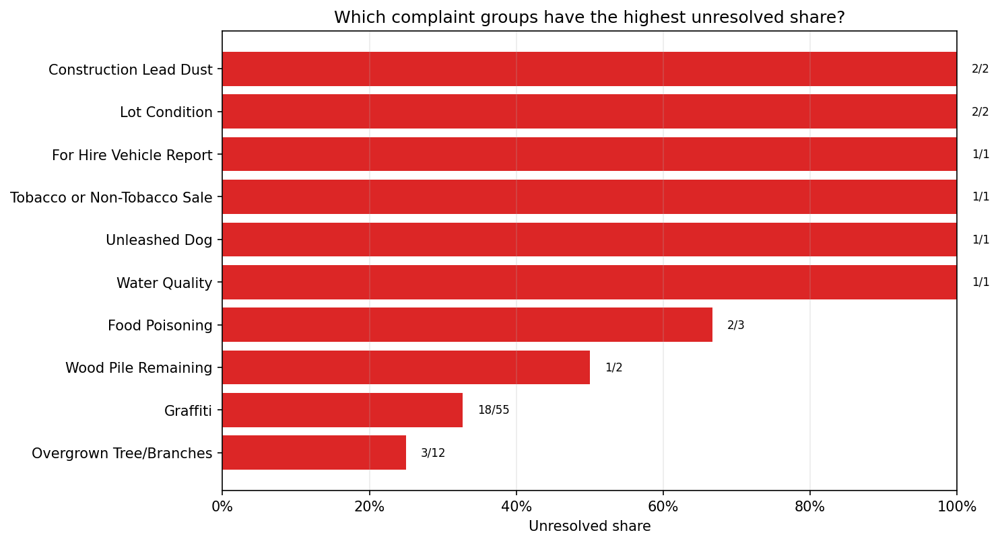

# Topic EDA Tearsheet

This tearsheet summarizes a cached Brooklyn slice and highlights topic-rule
coverage, unmatched descriptors, anomaly outliers, and resolution gaps. Refresh
and republish only when you intentionally want to update the tracked report
assets.

## Executive Summary

- The cached slice contains `5000` complaint records sourced from
  `cache/topic-eda-snapshot.csv` (`cache`).
- The weakest built-in topic coverage in this slice is `HEAT/HOT WATER` at
  `0.0%` matched.
- The strongest built-in topic coverage is `Noise - Residential` at `94.3%`
  matched.
- The biggest unmatched descriptor driver is `ENTIRE BUILDING` with `370`
  unmatched rows in the coverage audit.
- The largest anomaly by absolute z-score is `03 BROOKLYN / Party Music` at
  `+2.71`.
- The highest unresolved share in the cached slice appears in
  `Construction Lead Dust` at `100.0%` unresolved.
- In the synthetic Water System demo, custom rules change coverage from `100.0%`
  to `66.7%`.

## Coverage Rates

## Top Unmatched Descriptors

## Anomaly Scores

## Resolution Gaps

## Coverage Metrics

| Complaint type          | Matched | Total | Coverage rate | Top unmatched descriptor      |
| ----------------------- | ------- | ----- | ------------- | ----------------------------- |
| HEAT/HOT WATER          | 0       | 582   | 0.0%          | ENTIRE BUILDING               |
| Blocked Driveway        | 0       | 318   | 0.0%          | No Access                     |
| Noise - Street/Sidewalk | 0       | 125   | 0.0%          | Loud Music/Party              |
| Abandoned Vehicle       | 0       | 124   | 0.0%          | With License Plate            |
| UNSANITARY CONDITION    | 27      | 128   | 21.1%         | PESTS                         |
| Illegal Parking         | 444     | 1117  | 39.7%         | Posted Parking Sign Violation |
| Rodent                  | 22      | 35    | 62.9%         | Signs of Rodents              |
| Street Condition        | 89      | 131   | 67.9%         | Wear & Tear                   |
| Noise - Residential     | 480     | 509   | 94.3%         | Loud Talking                  |

## Resolution Hotspots

| Complaint type              | Unresolved count | Total requests | Unresolved share |
| --------------------------- | ---------------- | -------------- | ---------------- |
| Construction Lead Dust      | 2                | 2              | 100.0%           |
| Lot Condition               | 2                | 2              | 100.0%           |
| For Hire Vehicle Report     | 1                | 1              | 100.0%           |
| Tobacco or Non-Tobacco Sale | 1                | 1              | 100.0%           |
| Unleashed Dog               | 1                | 1              | 100.0%           |
| Water Quality               | 1                | 1              | 100.0%           |
| Food Poisoning              | 2                | 3              | 66.7%            |
| Wood Pile Remaining         | 1                | 2              | 50.0%            |
| Graffiti                    | 18               | 55             | 32.7%            |
| Overgrown Tree/Branches     | 3                | 12             | 25.0%            |

## Custom Rule Demo

| Scenario            | Coverage rate | Matched records | Total records |
| ------------------- | ------------- | --------------- | ------------- |
| Before custom rules | 100.0%        | 3               | 3             |
| After custom rules  | 66.7%         | 2               | 3             |
